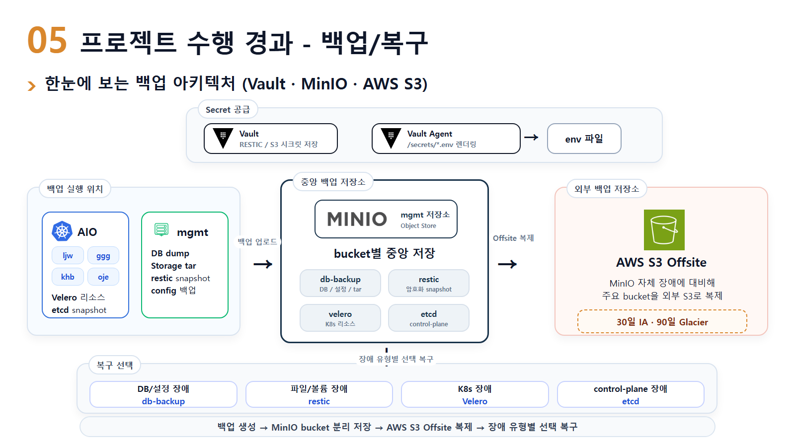
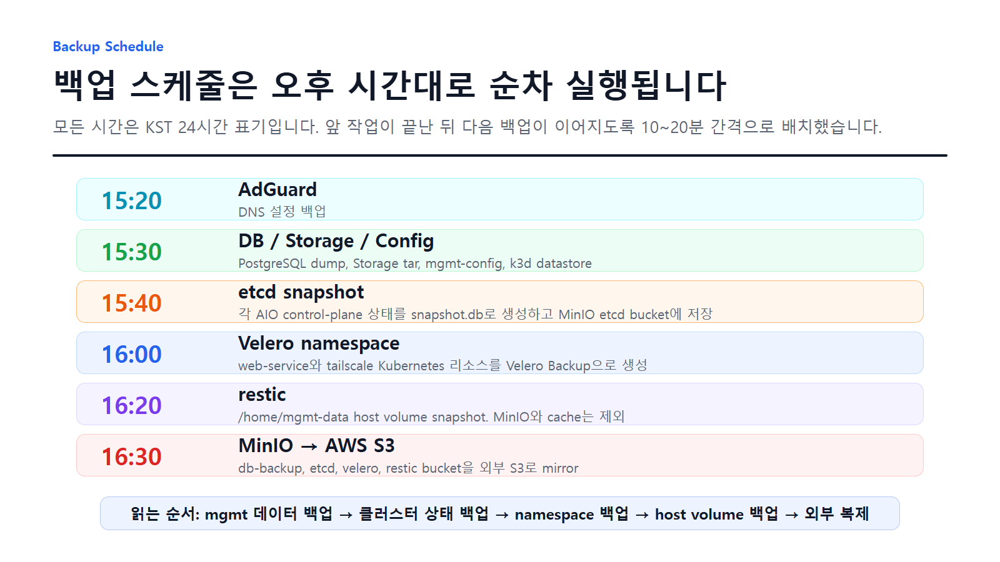

# Kubernetes Backup & Restore Portfolio

Kubernetes 기반 팀 프로젝트에서 백업/복구 파트를 담당하며 정리한 포트폴리오 문서입니다.

이 저장소는 실제 운영 저장소의 원본 파일을 복사한 것이 아니라, 프로젝트에서 설계하고 검증한 백업 구조를 **민감정보 없이 재구성한 제출용 자료**입니다.

## 한눈에 보는 구조

## 프로젝트에서 해결한 문제

서비스는 Kubernetes 클러스터 위에서 동작하고, 데이터베이스와 운영 도구는 mgmt 서버에서 관리되는 구조였습니다. 그래서 단일 도구로 모든 것을 백업하기보다, 복구 대상의 성격에 따라 백업 방식을 분리했습니다.

| 복구 대상 | 사용 도구 | 백업 결과 |
| --- | --- | --- |
| Kubernetes namespace 리소스 | Velero | Deployment, Service, ConfigMap, Secret |
| 클러스터 control-plane 상태 | etcd snapshot | `snapshot.db`, `SHA256SUMS` |
| PostgreSQL 데이터 | `pg_dump`, `pg_dumpall` | `postgres.dump`, `globals.sql` |
| Storage 파일과 설정 | `tar`, shell script | 압축 archive |
| mgmt 서버 볼륨 | restic | 암호화 snapshot repository |
| 중앙 백업 저장소 | MinIO | bucket/prefix 기반 보관 |
| 외부 백업 저장소 | AWS S3 | MinIO bucket mirror |

## 백업 스케줄

모든 시간은 KST 기준으로 통일했습니다.

| 시간 | 작업 | 목적 |
| --- | --- | --- |
| 15:20 | AdGuard 설정 백업 | DNS 설정 보관 |
| 15:30 | DB / Storage / Config 백업 | mgmt 데이터와 설정 보관 |
| 15:40 | etcd snapshot | AIO control-plane 상태 보관 |
| 16:00 | Velero namespace 백업 | 서비스 namespace 리소스 보관 |
| 16:20 | restic snapshot | mgmt host volume 보관 |
| 16:30 | MinIO to AWS S3 mirror | 외부 복제 저장 |

## 내가 담당한 역할

- 백업 대상을 Kubernetes 리소스, DB, 파일, control-plane 상태로 분류
- Velero Schedule과 Kubernetes CronJob 기반 백업 자동화 구조 정리
- mgmt 서버의 PostgreSQL dump, 설정 archive, k3d/K3s datastore 백업 흐름 정리
- MinIO bucket 구조를 백업 목적별로 분리
- AWS S3 offsite mirror 구조와 수명 주기 정책 방향 정리
- 장애 상황별 복구 테스트 시나리오 문서화

## 구현 핵심

### 1. GitOps 기반 Kubernetes 백업

Velero Schedule은 Kubernetes 리소스 백업을 담당하고, etcd snapshot은 CronJob으로 실행했습니다.

- Velero Schedule: namespace 리소스 백업
- CronJob: control-plane 노드에서 etcd snapshot 생성
- Argo CD: Git에 저장된 백업 설정을 각 클러스터에 반영

관련 문서: [GitOps 백업 구조](docs/gitops-velero-etcd.md)

### 2. mgmt 서버 백업

mgmt 서버에서는 컨테이너로 실행되는 DB와 host volume을 백업했습니다.

- PostgreSQL logical dump
- Storage 파일 archive
- 운영 설정 archive
- k3d/K3s SQLite datastore backup
- restic snapshot

관련 문서: [mgmt 백업 구조](docs/mgmt-backup.md)

### 3. 중앙 저장소와 외부 복제

백업 산출물은 MinIO에 목적별 bucket/prefix로 저장하고, 이후 AWS S3로 mirror했습니다.

- `velero`: Kubernetes 리소스 백업
- `etcd`: control-plane snapshot
- `db-backup`: DB dump, storage, config
- `restic`: host volume snapshot repository

관련 문서: [백업 아키텍처](docs/architecture.md)

## 복구 테스트 관점

백업은 파일 생성보다 복구 가능성이 중요하다고 판단했습니다. 그래서 각 백업별로 복구 시나리오를 분리했습니다.

| 장애 상황 | 복구 방식 |
| --- | --- |
| namespace 삭제 | Velero Restore |
| 회원 데이터 삭제 | PostgreSQL dump restore |
| mgmt volume 손상 | restic restore |
| control-plane 장애 검증 | etcd snapshot status / restore 검증 |
| MinIO 장애 | AWS S3 mirror에서 재동기화 |

관련 문서: [복구 Runbook](docs/restore-runbook.md)

## 예시 파일

실제 운영 파일이 아니라, 포트폴리오 설명용으로 재작성한 예시입니다.

- [Velero Schedule 예시](examples/velero-schedule.yaml)
- [etcd CronJob 예시](examples/etcd-snapshot-cronjob.yaml)
- [mgmt DB 백업 흐름 예시](examples/mgmt-db-backup-flow.sh)
- [MinIO to AWS S3 mirror 예시](examples/minio-offsite-mirror.sh)

## 보안 처리

이 저장소에는 다음 정보를 포함하지 않습니다.

- 실제 Access Key, Secret Key, Token
- 내부 도메인과 사설 IP
- 실제 팀원 prefix
- 실제 운영 bucket 이름
- `.env`, kubeconfig, certificate, private key

자세한 내용은 [SECURITY.md](SECURITY.md)를 참고하세요.

## 배운 점

백업에서 중요한 것은 단순히 백업 파일을 만드는 것이 아니라, 장애 상황에서 어떤 백업을 선택해 어떤 순서로 복구할 수 있는지 설명 가능한 구조를 만드는 것이라고 느꼈습니다.

Kubernetes 리소스, DB 데이터, 파일 볼륨, control-plane 상태는 복구 방식이 다르기 때문에 백업 도구도 분리되어야 했고, 이 과정을 통해 백업을 운영 안정성과 장애 대응 전략의 일부로 바라보게 되었습니다.
