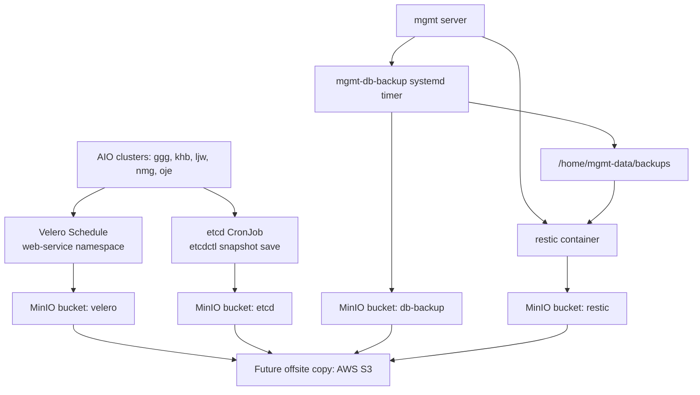

# Acer 프로젝트 백업 발표 자료

> 목적: 팀원이 현재 백업 구조를 이해하고, 어떤 데이터가 어디에 백업되는지, 장애 시 어떤 방식으로 복구 테스트를 진행할 수 있는지 설명할 수 있게 정리한다.

---

## 1. 백업을 왜 해야 하는가

서비스 운영에서 백업은 "문제가 생겼을 때 이전 상태로 돌아갈 수 있는 마지막 안전장치"다.

우리 프로젝트에서 백업이 필요한 대표 상황은 다음과 같다.

- 사용자가 데이터를 잘못 삭제한 경우
- 배포, 마이그레이션, 설정 변경 후 서비스가 깨진 경우
- mgmt 서버 디스크 장애 또는 서버 삭제
- Kubernetes 클러스터 장애
- Supabase PostgreSQL 또는 Storage 데이터 손상
- Harbor, GitLab, Grafana, Prometheus 같은 mgmt 서비스 볼륨 손상
- MinIO 장애 또는 백업 저장소 자체 손실

핵심은 "백업 파일이 존재한다"가 아니라 "복구 가능한 백업이 존재한다"이다. 그래서 백업 생성뿐 아니라 복구 테스트까지 필요하다.

---

## 2. 현재 백업 목표

현재 구성은 다음 백업 범위를 가진다.

| 구분 | 백업 대상 | 백업 도구 | 저장 위치 |
|---|---|---|---|
| Kubernetes 리소스 | 각 팀 AIO의 `web-service` namespace | Velero | MinIO `velero` bucket |
| AIO 클러스터 상태 | 각 팀 kubeadm control-plane의 etcd snapshot | etcdctl + CronJob | MinIO `etcd` bucket |
| Supabase DB | PostgreSQL logical dump | `pg_dump`, `pg_dumpall` | MinIO `db-backup` bucket, `/home/mgmt-data/backups` |
| Supabase Storage | 업로드 파일 디렉터리 tar | `tar` | MinIO `db-backup` bucket, `/home/mgmt-data/backups` |
| mgmt 설정 | `.env`, compose, secrets, k3d config, Argo CD repo | `tar` | MinIO `db-backup` bucket, `/home/mgmt-data/backups` |
| mgmt k3d datastore | k3d/K3s SQLite datastore | Python sqlite backup + `tar` | MinIO `db-backup` bucket, `/home/mgmt-data/backups` |
| mgmt host volumes | `/home/mgmt-data` 주요 볼륨 | restic | MinIO `restic` bucket |

---

## 3. 전체 백업 흐름



---

## 4. 사용한 백업 도구 설명

### Velero

Velero는 Kubernetes 리소스 백업/복구 도구다.

우리 프로젝트에서는 각 AIO 클러스터에 Velero가 설치되어 있고, `web-service` namespace를 매일 백업한다.

백업하는 것:

- Namespace 내부 Kubernetes 리소스
- Deployment, Service, ConfigMap, Secret 등 Kubernetes API 리소스
- 복구 시 `web-service` namespace와 리소스 재생성 가능

현재 설정에서 백업하지 않는 것:

- PV volume snapshot
- Supabase DB 같은 mgmt 서버 외부 데이터
- etcd 전체 클러스터 상태

현재 Velero Schedule에는 `snapshotVolumes: false`가 설정되어 있다. 즉 Velero는 현재 `web-service` namespace 리소스 중심 백업이다.

---

### etcdctl snapshot

etcd는 Kubernetes control-plane의 핵심 저장소다. kubeadm 클러스터에서는 API 리소스 상태가 etcd에 저장된다.

우리 AIO 클러스터는 확인 결과 5개 모두 kubeadm + etcd 구조다.

- `ggg`
- `khb`
- `ljw`
- `nmg`
- `oje`

각 클러스터에는 `kube-system` namespace에 `etcd-master` static pod가 존재한다.

백업 방식:

- CronJob이 control-plane 노드에서 실행
- hostPath로 `/etc/kubernetes/pki/etcd` 인증서 접근
- `etcdctl snapshot save /snapshot/snapshot.db`
- MinIO `etcd` bucket으로 업로드

---

### PostgreSQL dump

Supabase의 데이터베이스는 PostgreSQL이다. DB는 단순 볼륨 복사보다 logical dump가 복구 안정성이 높다.

사용 명령:

- `pg_dump -Fc`
- `pg_dumpall --globals-only`

생성 파일:

- `postgres.dump`: PostgreSQL 데이터베이스 dump
- `globals.sql`: role, global object 등
- `SHA256SUMS`: 무결성 확인용 checksum

---

### tar 기반 파일 백업

Supabase Storage와 mgmt 설정은 파일/디렉터리 단위로 백업한다.

Supabase Storage:

- `/home/mgmt-data/supabase/storage`
- 사용자가 업로드한 이미지, 문서, 첨부파일 등

mgmt 설정:

- `/home/user1/acer-mgmt/.env`
- `/home/user1/acer-mgmt/compose`
- `/home/user1/acer-mgmt/secrets`
- `/home/user1/acer-mgmt/k3d`
- `/home/user1/acer-argocd`

주의: 설정 백업에는 민감정보가 포함될 수 있다. 접근 권한을 제한해야 한다.

---

### restic

restic은 파일 시스템 스냅샷 백업 도구다. 중복 제거와 암호화를 지원한다.

현재 백업 대상:

- `/home/mgmt-data`

현재 제외 대상:

- `/home/mgmt-data/minio`
- `/home/mgmt-data/restic-cache`

즉 restic은 mgmt 서비스 볼륨을 백업하지만, MinIO 데이터 디렉터리 자체는 백업하지 않는다.

이유:

- restic repository 자체가 MinIO `restic` bucket에 저장됨
- MinIO 데이터 디렉터리를 다시 restic에 넣으면 순환 백업 구조가 됨

따라서 MinIO 자체 장애까지 대비하려면 MinIO bucket들을 AWS S3 같은 외부 저장소로 복제해야 한다.

---

## 5. MinIO bucket별 백업 항목

현재 MinIO에는 백업 목적별 bucket이 분리되어 있다.

```text
db-backup
etcd
restic
velero
```

---

## 6. bucket: db-backup

`db-backup`은 mgmt 서버에서 생성한 명시적인 백업 산출물을 저장한다.

구조:

```text
db-backup/
  supabase-postgres/
    daily/<timestamp>/
      postgres.dump
      globals.sql
      SHA256SUMS

  supabase-storage/
    daily/<timestamp>/
      supabase-storage.tar.gz
      SHA256SUMS

  mgmt-config/
    daily/<timestamp>/
      mgmt-config.tar.gz
      SHA256SUMS

  k3d-mgmt-datastore/
    daily/<timestamp>/
      k3s-sqlite-datastore.tar.gz
      SHA256SUMS
```

### supabase-postgres

백업 내용:

- Supabase PostgreSQL 데이터
- 사용자 테이블
- 인증 데이터
- schema
- function
- role/global 설정

복구 방식:

- PostgreSQL 컨테이너 준비
- `globals.sql` 적용
- `postgres.dump`를 `pg_restore`로 복구

### supabase-storage

백업 내용:

- Supabase Storage 파일
- 업로드 이미지
- 첨부파일
- 문서 object 파일

복구 방식:

- Supabase Storage 디렉터리에 `supabase-storage.tar.gz` 압축 해제

중요: DB와 Storage는 함께 맞춰야 한다. DB에는 파일 경로/metadata가 있고, Storage에는 실제 파일이 있다.

### mgmt-config

백업 내용:

- mgmt 서버 재구성에 필요한 설정
- `.env`
- compose 파일
- secrets
- k3d 설정
- Argo CD GitOps repo

복구 방식:

- 새 mgmt 서버에 압축 해제
- compose stack 재기동
- 필요한 secret과 `.env` 복원

### k3d-mgmt-datastore

백업 내용:

- mgmt 내부 k3d/K3s datastore
- SQLite state DB
- token 파일이 있으면 함께 포함

복구 방식:

- k3d/K3s 중지
- datastore 파일 복원
- k3d/K3s 재시작

---

## 7. bucket: etcd

`etcd` bucket은 AIO 클러스터의 etcd snapshot을 저장한다.

구조:

```text
etcd/
  ggg/
    daily/<timestamp>/
      snapshot.db
      SHA256SUMS
  khb/
    daily/<timestamp>/
      snapshot.db
      SHA256SUMS
  ljw/
    daily/<timestamp>/
      snapshot.db
      SHA256SUMS
  nmg/
    daily/<timestamp>/
      snapshot.db
      SHA256SUMS
  oje/
    daily/<timestamp>/
      snapshot.db
      SHA256SUMS
```

백업 내용:

- kubeadm cluster의 etcd snapshot
- Kubernetes 전체 API 상태 저장소

주의:

- etcd snapshot은 클러스터 전체 상태 복구용이다.
- 일반적인 namespace 단위 복구는 Velero가 더 적합하다.
- etcd restore는 control-plane 복구 절차가 필요하므로 운영 중 클러스터에 가볍게 실행하는 복구 테스트가 아니다.

---

## 8. bucket: velero

`velero` bucket은 Kubernetes namespace 백업을 저장한다.

구조 예시:

```text
velero/
  ggg/
    backups/
  khb/
    backups/
  ljw/
    backups/
    restores/
  nmg/
    backups/
  oje/
    backups/
  kopia/
```

백업 내용:

- 각 팀 AIO의 `web-service` namespace Kubernetes 리소스
- Velero backup metadata
- restore metadata

현재 팀별 prefix:

- `velero/ggg`
- `velero/khb`
- `velero/ljw`
- `velero/nmg`
- `velero/oje`

복구 방식:

- `velero backup get`
- `velero restore create --from-backup <backup-name>`
- namespace 삭제 후 복구 테스트 가능

주의:

- 현재 설정은 `snapshotVolumes: false`
- PV 데이터 자체 복구 목적이 아니라 Kubernetes 리소스 복구 목적

---

## 9. bucket: restic

`restic` bucket은 restic repository다.

구조:

```text
restic/
  config
  data/
  index/
  keys/
  snapshots/
```

백업 내용:

- `/home/mgmt-data` 주요 볼륨
- GitLab, Harbor, Grafana, Prometheus, ELK, Kafka, Vault 등 mgmt 서비스 볼륨
- Supabase 볼륨도 파일 단위로 포함

제외 내용:

- `/home/mgmt-data/minio`
- `/home/mgmt-data/restic-cache`

보관 정책:

```text
daily 7개
weekly 4개
monthly 6개
```

주의:

- restic repository는 암호화되어 있다.
- `RESTIC_PASSWORD`가 없으면 복구할 수 없다.
- MinIO가 날아가면 restic repository도 함께 사라질 수 있으므로 AWS S3 복제가 필요하다.

---

## 10. 백업 스케줄

| 백업 | 실행 시간 | 구현 방식 | 이유 |
|---|---:|---|---|
| mgmt DB/Storage/Config/k3d backup | 매일 15:30 KST | systemd timer | DB dump와 mgmt 설정 백업을 먼저 생성 |
| AIO etcd snapshot | 매일 15:40 KST | Kubernetes CronJob | DB 백업과 겹치지 않게 10분 뒤, Velero보다 먼저 수행 |
| Velero web-service backup | 매일 16:00 KST | Velero Schedule | etcd snapshot 이후 namespace 리소스 백업 |
| restic host volume backup | 매일 16:20 KST | container loop | 다음 16:20 KST까지 대기 후 파일 볼륨 snapshot 생성 |

### 왜 오후 15~16시인가

- 발표/운영 확인이 쉬운 오후 시간대
- 백업 작업 결과를 당일에 바로 확인 가능
- DB dump, etcd snapshot, Velero backup을 순차적으로 배치해 부하와 충돌을 줄임
- 문제가 생기면 당일 안에 조치 가능

### restic 스케줄 주의

restic은 현재 별도 cron 리소스가 아니라 컨테이너 내부 대기 로직으로 "매일 16:20 KST"에 맞춰 실행된다.

현재 compose는 다음 흐름이다.

```text
restic backup 실행
restic forget/prune 실행
RESTIC_BACKUP_TIME=16:20:00
반복
```

따라서 컨테이너가 재시작되어도 다음 16:20 KST 실행 시각을 다시 계산한다.

---

## 11. GitOps 구성

백업 리소스는 GitOps로 관리한다.

Argo CD Application:

```text
velero-schedule-ggg
velero-schedule-khb
velero-schedule-ljw
velero-schedule-nmg
velero-schedule-oje
```

Git path:

```text
acer-argocd/backup/base
acer-argocd/backup/ggg
acer-argocd/backup/khb
acer-argocd/backup/ljw
acer-argocd/backup/nmg
acer-argocd/backup/oje
```

base에는 공통 리소스가 있다.

- Velero Schedule
- etcd snapshot CronJob

팀별 overlay에서는 `CLUSTER_NAME`만 팀 이름으로 patch한다.

---

## 12. 복구 테스트: db-backup bucket

### PostgreSQL dump 복구 테스트

목표:

- dump 파일이 실제로 PostgreSQL에 restore 가능한지 확인
- 운영 DB에 바로 덮어쓰지 않고 테스트 DB 또는 임시 컨테이너에서 검증

테스트 흐름:

```bash
# 1. MinIO에서 postgres.dump, globals.sql 다운로드
mc cp --recursive local/db-backup/supabase-postgres/daily/<timestamp>/ ./restore-postgres/

# 2. 임시 PostgreSQL 컨테이너 준비
docker run --rm -d --name pg-restore-test \
  -e POSTGRES_PASSWORD=test \
  postgres:17

# 3. globals.sql 적용
cat ./restore-postgres/globals.sql | docker exec -i pg-restore-test psql -U postgres

# 4. dump restore
cat ./restore-postgres/postgres.dump | docker exec -i pg-restore-test pg_restore -U postgres -d postgres --clean --if-exists

# 5. 테이블/row 확인
docker exec -it pg-restore-test psql -U postgres -d postgres
```

주의:

- 운영 DB에 바로 restore하지 않는다.
- Supabase 버전과 PostgreSQL major version을 맞추는 것이 안전하다.

### Supabase Storage 복구 테스트

목표:

- tar 파일이 정상적으로 풀리는지 확인
- 실제 파일이 존재하는지 확인

테스트 흐름:

```bash
mc cp local/db-backup/supabase-storage/daily/<timestamp>/supabase-storage.tar.gz .
mkdir -p /tmp/storage-restore-test
tar -xzf supabase-storage.tar.gz -C /tmp/storage-restore-test
find /tmp/storage-restore-test -type f | head
```

### mgmt-config 복구 테스트

목표:

- 새 mgmt 서버 bootstrap에 필요한 설정이 들어있는지 확인

테스트 흐름:

```bash
mc cp local/db-backup/mgmt-config/daily/<timestamp>/mgmt-config.tar.gz .
mkdir -p /tmp/mgmt-config-test
tar -xzf mgmt-config.tar.gz -C /tmp/mgmt-config-test
find /tmp/mgmt-config-test -maxdepth 3 -type f | sort
```

확인해야 할 것:

- `.env`
- compose 파일
- secrets
- k3d 설정
- acer-argocd repo

### k3d-mgmt-datastore 복구 테스트

목표:

- SQLite datastore tar가 정상인지 확인

테스트 흐름:

```bash
mc cp local/db-backup/k3d-mgmt-datastore/daily/<timestamp>/k3s-sqlite-datastore.tar.gz .
mkdir -p /tmp/k3d-datastore-test
tar -xzf k3s-sqlite-datastore.tar.gz -C /tmp/k3d-datastore-test
sqlite3 /tmp/k3d-datastore-test/state.db 'pragma integrity_check;'
```

운영 복구 시에는 k3d/K3s를 중지한 뒤 datastore를 원위치에 복원해야 한다.

---

## 13. 복구 테스트: etcd bucket

목표:

- snapshot 파일이 존재하고 checksum이 맞는지 확인
- 필요하면 격리된 테스트 control-plane에서 restore 절차 검증

기본 검증:

```bash
mc cp --recursive local/etcd/ljw/daily/<timestamp>/ ./restore-etcd/
cd ./restore-etcd
sha256sum -c SHA256SUMS
```

snapshot status 확인:

```bash
etcdctl snapshot status snapshot.db --write-out=table
```

주의:

- 운영 중인 클러스터에 바로 etcd restore를 수행하면 안 된다.
- etcd restore는 control-plane 재구성 절차다.
- 일반적인 namespace 복구는 Velero로 테스트하고, etcd restore는 별도 격리 환경에서 검증하는 것이 안전하다.

---

## 14. 복구 테스트: velero bucket

목표:

- `web-service` namespace 리소스가 Velero backup으로 복구되는지 확인

확인 명령:

```bash
velero backup get
velero backup describe <backup-name> --details
```

복구 테스트 예시:

```bash
# 위험: namespace 삭제 테스트는 사전에 합의된 테스트 환경에서만 수행
kubectl delete ns web-service

velero restore create web-service-restore-test \
  --from-backup <backup-name>

velero restore get
velero restore describe web-service-restore-test --details
kubectl get all -n web-service
```

주의:

- Argo CD가 관리하는 앱이면 삭제 후 Argo CD가 다시 sync할 수도 있다.
- Velero 복구와 Argo CD sync의 역할을 구분해야 한다.
- 현재 Velero는 PV snapshot을 하지 않으므로 DB/파일 복구는 별도 백업을 사용한다.

---

## 15. 복구 테스트: restic bucket

목표:

- restic repository가 열리는지 확인
- 특정 디렉터리를 임시 위치로 restore할 수 있는지 확인

확인 명령:

```bash
docker exec restic restic snapshots
docker exec restic restic stats latest
docker exec restic restic ls latest /source
```

임시 위치 복구 테스트:

```bash
mkdir -p /home/mgmt-data-restore-test

docker run --rm --network mgmt-proxy \
  -e RESTIC_REPOSITORY=s3:http://minio:9000/restic \
  -e RESTIC_PASSWORD="$RESTIC_PASSWORD" \
  -e AWS_ACCESS_KEY_ID="$RESTIC_ACCESS_KEY" \
  -e AWS_SECRET_ACCESS_KEY="$RESTIC_SECRET_KEY" \
  -v /home/mgmt-data-restore-test:/restore \
  restic/restic:0.19.0 \
  restore latest --target /restore --include /source/grafana
```

주의:

- 운영 위치에 바로 restore하지 않는다.
- 먼저 임시 위치로 복구한 뒤 파일 구조와 권한을 확인한다.
- `RESTIC_PASSWORD`가 없으면 복구할 수 없다.

---

## 16. 장애 시 복구 우선순위

### web-service namespace만 깨진 경우

1. Argo CD 상태 확인
2. GitOps sync로 복구 가능한지 확인
3. 필요하면 Velero restore 수행

### Supabase DB 장애

1. 서비스 중지 또는 write 차단
2. `db-backup/supabase-postgres`에서 dump 선택
3. PostgreSQL restore
4. Supabase Storage와 timestamp 정합성 확인

### Supabase Storage 장애

1. `db-backup/supabase-storage`에서 tar 선택
2. Storage 디렉터리에 압축 해제
3. DB metadata와 파일 존재 확인

### AIO control-plane 장애

1. etcd snapshot 선택
2. control-plane 복구 절차 진행
3. kube-apiserver 정상화 확인
4. Velero/Argo CD로 namespace 상태 확인

### mgmt 서버 전체 장애

1. 새 mgmt 서버 준비
2. AWS S3 또는 외부 저장소에서 MinIO bucket 백업 회수
3. `db-backup/mgmt-config` 복구
4. compose stack 재기동
5. MinIO bucket 복구
6. restic repository 복구
7. restic으로 `/home/mgmt-data` 필요한 볼륨 복원
8. DB는 PostgreSQL dump 기준으로 복구

---

## 17. 3-2-1 백업 관점

현재 로컬 구조:

```text
원본 데이터: mgmt/AIO 운영 데이터
로컬 백업: MinIO buckets
```

여기에 AWS S3로 MinIO bucket 전체를 복제하면:

```text
1. 원본 데이터
2. 로컬 MinIO 백업
3. AWS S3 오프사이트 백업
```

3-2-1에 가까운 구조가 된다.

단, 중요한 조건:

- AWS S3 계정/IAM은 mgmt 서버와 분리
- S3 bucket versioning 활성화
- 가능하면 Object Lock 또는 삭제 방지 정책 적용
- `mc mirror --remove`처럼 삭제 전파가 되는 방식은 주의
- 복구 테스트를 정기적으로 수행

---

## 18. 현재 확인된 사용량

최근 확인 기준 MinIO bucket 사용량:

```text
db-backup   3.2 MiB
etcd        47 MiB
restic      2.7 GiB
velero      264 KiB
```

총량은 약 2.75 GiB 수준이다.

현재는 비용보다 구조가 더 중요하다. 하지만 AWS S3 Standard 서울 리전 기준으로는 월 비용이 매우 작다.

```text
2.75 GB * $0.025 / GB-month = 약 $0.07 / month
```

---

## 19. 팀원이 꼭 기억해야 할 것

1. Velero는 Kubernetes 리소스 백업이다.
2. DB는 Velero가 아니라 PostgreSQL dump로 복구한다.
3. Supabase Storage는 DB와 별도 파일 백업이다.
4. etcd snapshot은 클러스터 전체 상태 복구용이다.
5. restic은 `/home/mgmt-data` 볼륨 백업이지만 MinIO 자체는 제외한다.
6. MinIO가 단일 장애점이므로 AWS S3 외부 복제가 필요하다.
7. 백업은 생성보다 복구 테스트가 더 중요하다.
8. 운영 위치에 바로 restore하지 말고 임시 위치에서 먼저 검증한다.

---

## 20. 발표 마무리 멘트

이번 백업 구성의 핵심은 데이터를 성격별로 나누어 저장한 것이다.

- Kubernetes 리소스는 Velero
- 클러스터 control-plane 상태는 etcd snapshot
- DB는 PostgreSQL dump
- 업로드 파일은 Storage tar
- mgmt 설정은 config tar
- host volume은 restic
- 백업 저장소는 MinIO
- MinIO 자체 보호는 AWS S3 오프사이트 복제

즉 하나의 도구로 모든 것을 해결하려는 구조가 아니라, 데이터 성격에 맞는 도구를 나누어 사용했다.

최종 목표는 "백업이 있다"가 아니라 "필요한 시점의 데이터를 실제로 복구할 수 있다"이다.
