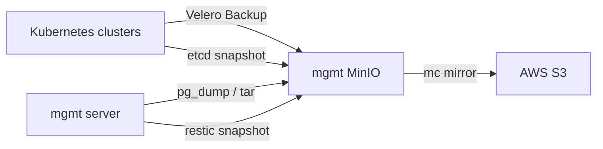

# Backup Architecture

## 목표

백업 구조의 목표는 단순 파일 보관이 아니라, 장애 유형별로 복구 가능한 백업을 남기는 것입니다.

프로젝트에서는 백업 대상을 다음 네 가지로 나누었습니다.

| 대상 | 예시 | 복구 기준 |
| --- | --- | --- |
| Kubernetes 리소스 | namespace, Deployment, Service, Secret | 클러스터 API에 다시 생성 가능한가 |
| 데이터베이스 | PostgreSQL user/task data | 논리 데이터 단위로 복구 가능한가 |
| 파일 볼륨 | Harbor, GitLab, Grafana volume | 디렉터리 snapshot으로 되돌릴 수 있는가 |
| 클러스터 상태 | etcd data | control-plane 상태를 검증/복원할 수 있는가 |

## 전체 흐름

## MinIO bucket 설계

백업은 하나의 bucket에 섞지 않고 목적별로 분리했습니다.

| Bucket | 저장 내용 | 이유 |
| --- | --- | --- |
| `velero` | Kubernetes 리소스 백업 | namespace 단위 복구 |
| `etcd` | `snapshot.db`, checksum | control-plane 상태 백업 |
| `db-backup` | DB dump, storage archive, config archive | mgmt 데이터 복구 |
| `restic` | restic repository | host volume snapshot |

이렇게 분리하면 복구 시점에 "어떤 백업을 써야 하는지"를 빠르게 판단할 수 있습니다.

## AWS S3 offsite mirror

MinIO는 중앙 백업 저장소이지만, mgmt 서버 자체 장애가 발생하면 백업 저장소도 함께 영향을 받을 수 있습니다. 그래서 MinIO bucket을 AWS S3로 복제하는 구조를 추가했습니다.

AWS S3에서는 수명 주기 정책을 적용해 장기 보관 비용을 낮출 수 있습니다.

예시 정책:

| 기간 | Storage Class |
| --- | --- |
| 0~30일 | S3 Standard |
| 30일 이후 | S3 Standard-IA |
| 90일 이후 | S3 Glacier Flexible Retrieval |

## 설계 포인트

- 최근 백업은 빠른 복구를 위해 MinIO와 S3 Standard에 유지
- 오래된 백업은 S3 Lifecycle로 비용 최적화
- 백업 산출물마다 checksum을 남겨 무결성 확인 가능
- 백업 생성 시간은 KST로 통일해 운영자가 혼동하지 않도록 구성
