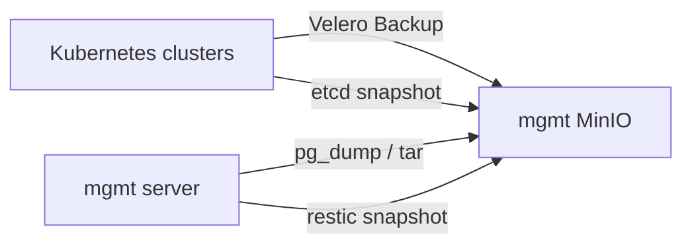

# Backup Architecture

## 목표

백업 구조의 목표는 단순 파일 보관이 아니라, 장애 유형별로 복구 가능한 백업을 남기는 것입니다.

프로젝트에서는 백업 대상을 다음 네 가지로 나누었습니다.

| 대상 | 예시 | 복구 기준 |
| --- | --- | --- |
| Kubernetes 리소스 | namespace, Deployment, Service, Secret | 클러스터 API에 다시 생성 가능한가 |
| 데이터베이스 | PostgreSQL user/task data | 논리 데이터 단위로 복구 가능한가 |
| 파일 볼륨 | Harbor, GitLab, Grafana volume | 디렉터리 snapshot으로 되돌릴 수 있는가 |
| 클러스터 상태 | etcd data | control-plane 상태를 검증/복원할 수 있는가 |

## 전체 흐름

## MinIO bucket 설계

백업은 하나의 bucket에 섞지 않고 목적별로 분리했습니다.

| Bucket | 저장 내용 | 이유 |
| --- | --- | --- |
| `velero` | Kubernetes 리소스 백업 | namespace 단위 복구 |
| `etcd` | `snapshot.db`, checksum | control-plane 상태 백업 |
| `db-backup` | DB dump, storage archive, config archive | mgmt 데이터 복구 |
| `restic` | restic repository | host volume snapshot |

이렇게 분리하면 복구 시점에 "어떤 백업을 써야 하는지"를 빠르게 판단할 수 있습니다.

## AWS S3 offsite 복제와 생명주기 정책

mgmt MinIO의 주요 백업 bucket을 AWS S3로 복제해 MinIO 장애에 대비한 offsite 사본을 확보했습니다. AWS S3 버킷에는 생명주기 정책을 적용해 오래된 백업 객체의 장기 보관 비용을 줄이도록 구성했습니다.

## 설계 포인트

- 백업 대상별로 저장 위치와 복구 방법을 구분
- MinIO 주요 백업 bucket을 AWS S3로 외부 복제
- AWS S3 생명주기 정책으로 장기 보관 비용 관리
- 백업 산출물마다 checksum을 남겨 무결성 확인 가능
